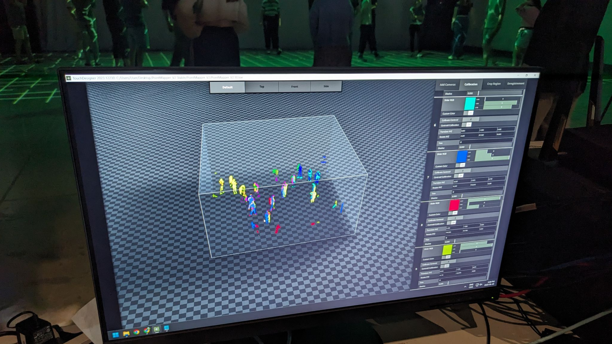

# PointMapper 0.0.1

PointMapper est un outil de fusion de données de profondeur qui a été développé pour le projet de recherche en interaction collective de la SAT.

PointMapper existe présentement en deux versions : une version en TouchDesigner et une version standalone développée avec Godot.
