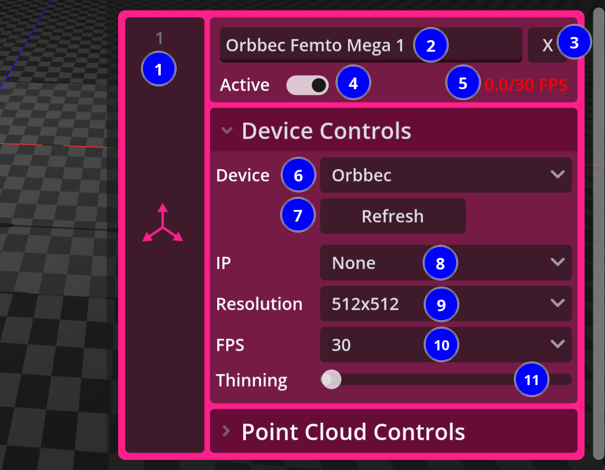
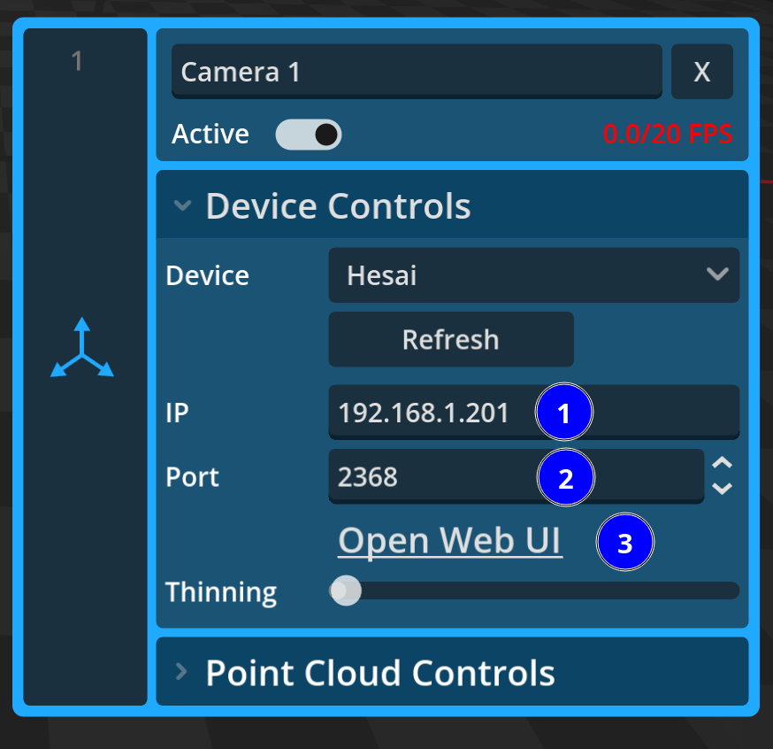
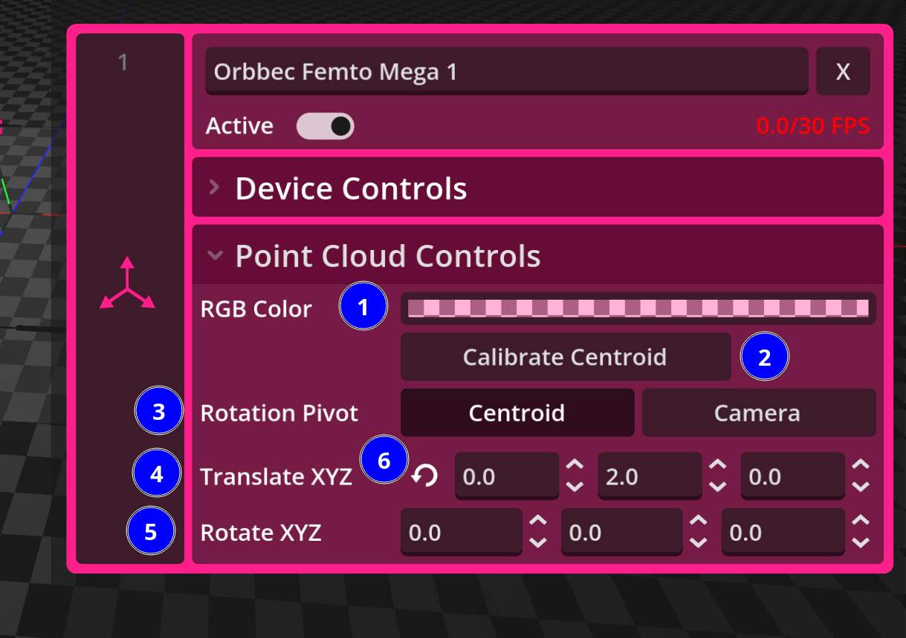

# Dispositifs

Carto supporte actuellement les Orbbec Femto Mega et les Hesai Pandar 40P. Il est possible que d'autres dispositifs Orbbec et d'autres dispositifs hesai fonctionnent mais ils n'ont pas été testés et peuvent ne pas être supportés optimalement.

## Orbbec Femto Mega et controles génériques d'un dispositif

Les Orbbec Femto Mega ont été les premières caméras à être intégrées à Carto. Lorsqu'une caméra est instanciée dans Carto, le dispositif par défaut est "Orbbec", ce qui réfère à une orbbec femto mega.

L'utilisation d'une Orbbec est très simple: une fois branchée à un commutateur réseau PoE, la caméra annonce son identité sur le réseau, ce qui permet à Carto de l'auto-découvrir.

### Paramètres des Orbbec Femto Mega dans Carto

Cette capture d'écran annotée montre les différents contrôles liés à une orbbec femto mega ainsi que les contrôles génériques d'un dispositif.

1. Bouton gizmo. Cliquez sur ce bouton pour obtenir un gizmo sur ce dispositif dans la vue 3D. Il est possible d'appuyer sur Ctrl+click pour sélectionner plusieurs dispositifs.
2. Nom de la caméra. Ce nom apparaîtra dans la vue 3D lorsque ce dispositif est sélectionné.
3. Bouton de suppression du dispositif. Un dispositif supprimé sera aussi déconnecté. Il est possible de revenir en arrière avec Ctrl+Z
4. Bouton d'activation et de désactivation d'un dispositif. Un dispositif désactivé sera aussi déconnecté. Il ne consommera plus de resources réseau ou computationnelles.
5. Compteur de "frame rate". Ce compteur représente le nombre de trames de nuage de point par seconde que Carto reçoit du dispositif. **Important**: cette valeur est indépendante du taux de rafraichissement de Carto.
6. Menu de sélection des dispositifs.
7. Bouton de rafraichissement. Il est possible de forcer une caméra à se reconnecter en cliquant sur ce bouton.
8. Menu déroulant des IPs. Pour les orbbec, ce menu déroulant permet de sélectionner une adresse IP parmis la liste des caméras détectées.
9. Menu déroulant des résolutions. Permet de sélectionner une des résolutions valides pour les Orbbec femto mega.
10. Menu déroulant des taux d'envois. Permet de sélectionner le taux d'envois demandé à la Orbbec. Se met à jour automatiquement si une résolution demandée n'est pas compatible avec le taux d'envois demandé.
11. Menu du "thinning". Disponible pour tous les dispositifs, permet d'amincir le nuage de point affiché.

### Bande passante utilisée selon les configurations d'une Orbbec Femto Mega

Voici un tableau qui pourra vous aider à planifier l'infrastructure réseau nécessaire à votre installation.

| Débit en Mibps en fonction de la résolution et du taux d'envois | 320x288    | 512x512   | 640x576   | 1024x1024 |
|-----------------------------------------------------------------|------------|-----------|-----------|-----------|
| 30 fps                                                          |44.4 Mibps  |125 Mibps  |178 Mibps  |N/A        |
| 25 fps                                                          |37.0 Mibps  |106 Mibps  |148 Mibps  |N/A        |
| 15 fps                                                          |22.5 Mibps  |64.2 Mibps |90.1 Mibps |253 Mibps  |
|  5 fps                                                          |7.44 Mibps  |21.2 Mibps |30.1 Mibps |85.1 Mibps |

## Hesai Pandar 40P

Les lidar Hesai 40P demandent un peu plus de configuration.

Après les avoir branché dans commutateur réseau, vous devez aller trouver leur adresse sur le réseau et vous rendre sur `http://<adresse de votre hesai>/setting.html` puis changer les champs ip de destination et port TODO: aller voir c'est quoi les champ et mettre un screenshot.

Voici une capture d'écran montrant les contrôles propres aux dispositifs de type Hesai.

1. IP du hesai. Il n'est pas strictement obligatoire de mettre la bonne IP pour recevoir des points mais avoir la bonne ip assure que le bouton "Open Web UI" fonctionne.
2. Port. Le port du hesai. Si vous avez plusieurs hesais sur le même réseau, vous devez changer ce port pour avoir un port unique pour chaque hesai.
3. Open Web UI. Ce bouton ouvre un navigateur qui vous montrera les configurations du hesai qui est à l'adresse IP indiquée. Vous pouvez changer les autres paramètres du hesai à partir de cette interface web.

## Contrôle de nuage de point

Ces contrôles sont disponibles pour tous types de dispositifs et permettent de contrôler l'affichage des points dans la vue 3D.

1. RGB Color. Couleur RGBA des points affichés.
2. Calibrate Centroid. Cliquer sur ce bouton déclenche un calcul du centroïde du nuage de point. Ce calcul est fait automatiquement lors de la première réception de points mais si la caméra a été déplacée ou si l'environemment change beaucoup il peut être préférable de recalculer le centroïde.
3. Rotation Pivot. Ceci contrôle le pivot de rotation du nuage de point. Quand le pivot de rotation est à "Centroid", le gizmo de manipulation apparaît près du "centre" du nuage de point et la rotation se fait depuis le milieu. C'est le comportement par défaut. Quand le pivot de rotation est à "Camera", le gizmo de manipulation apparaît sur l'icône de caméra et le nuage de point pivote comme si on bougait la caméra qui le capte.
4. Contrôles fins de translation. Permet d'ajuster finement la position du nuage de point dans l'espace
5. Contrôles fins de rotation. Permet d'ajuster finement la rotation du nuage de point dans l'espace.
6. Boutons de retours à 0. Lorsqu'une rotation ou une translation est modifiée, permet de revenir à 0. Notes que tous les changements de rotation et de translation sont aussi réversible avec la commande Ctrl-Z
