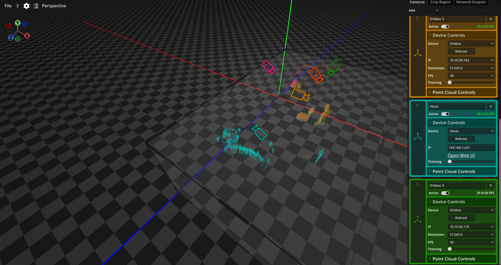

# Carto

Carto est un outil de calibration d'acquisition, de calibration et de fusion de nuage de points développé par le département de l'innovation de la Société des Arts Technologiques.

Carto permet de se connecter à plusieurs dispositifs de captation volumétriques et de calibrer leurs nuages de points pour créer une cartographie cohérente d'une espace. Le nuage de point fusionné qui résulte de cette calibration peut ensuite être envoyée en temps réel à d'autres logiciels sous forme de vues orthographique ou en données brutes.

## License

Carto est distribué sous license AGPL-3.0
