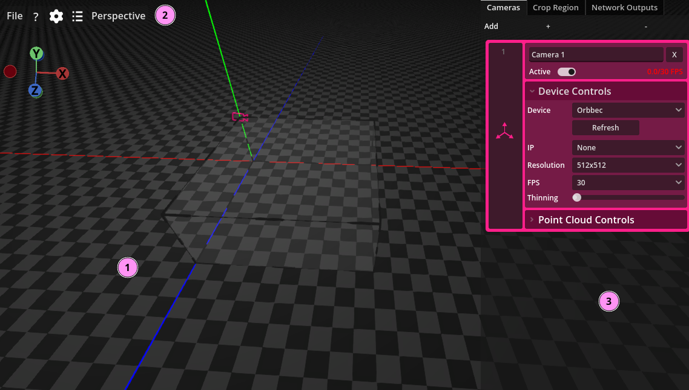
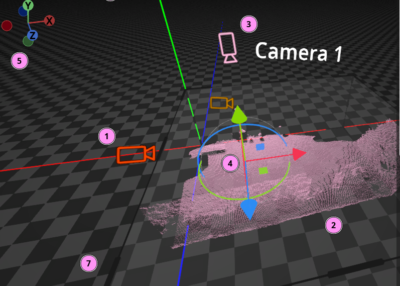
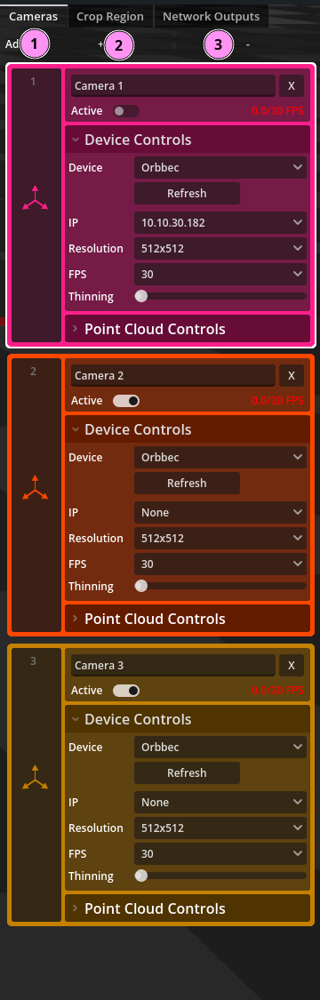

# Utilisation

## Survol de l'interface

L'interface de Carto est séparée en plusieurs sections.

La section 1 sur l'image est la vue 3D. Elle contient tous les éléments qui font partie de la cartographie 3D de l'espace: Les caméras, les nuages de points et la zone d'inclusion (crop region).

La section 2 est la barre d'outils qui contient plusieurs boutons et menus.

La section 3 est le menu latéral qui permet d'instancier des caméras, de paramétrer la zone d'inclusion et d'instancier des sorties réseau.

### Contrôles de la vue 3D

La vue 3D contient les différents éléments de votre cartographie 3D. Ce qui suit est une description des éléments numérotés sur la capture d'écran.

1. Icônes de caméras. Ces icones prennent la couleur défini dans le menu de droite. Chaque icône pointe vers le centroïde du nuage de point capté par le dispositif qu'elle représente.
2. Nuage de point. Affichage du nuage de point représenté par la caméra. Le nuage sera de la couleur configuré dans le menu de droite.
3. Nom de la caméra. Ce nom n'est affiché que lorsque la caméra est sélectionné ou lorsque le curseur de la souris est par dessus l'icône de la caméra.
4. Gizmo de manipulation caméra. Ce gizmo permet de manipuler la rotation et la translation d'une caméra et de son nuage de point. Les flèches permettent de déplacer les caméras dans chacun des axes, les carrés permettent de déplacer une caméra sur deux axes et les arcs de cercles permettent de faire des rotations.
5. Gizmo du point de vue. Ce gizmo permet de manipuler la caméra de point de vue. On peut cliquer-glisser sur la surface circulaire du gizmo pour effectuer une rotation de la caméra et cliquer sur les ronds représentant les axes pour obtenir des vues orthographiques.
<!-- woops, 6 était de trop dans le screenshot. à corriger dans la prochaine version -->
7. Région d'inclusion. Le volume grisé représente la zone dans laquelle les points seront conservés. Il est possible d'obtenir un gizmo sur cette zone en cliquant sur les poignées

### Barre d'outils

1. Menu fichier. Avec les options classique enregistrer, enregistrer-sous et charger.
2. Bouton d'aide qui afficher un menu décrivant les contrôles.
3. Bouton de configurations qui affiche le menu des configurations globales.
4. Menu du journal des événements. Les "logs" d'erreurs et d'avertissement seront affichées dans une fenêtre accessible en cliquant ce bouton.
5. Menu déroulant des vues orthographiques. Ce menu déroulant permet de sélectionner soit la vue en perspectives ou une des vues orthographiques.

### Menu

1. Onglet des caméras. Cet onglet contient les contrôles permettant d'instancier des dispositifs de capture et de les paramétrer.
2. Onglet de la zone d'inclusion ("crop region"). Cet onglet permet de paramétrer la taille et la position de la zone d'inclusion.
3. Onglet des sorties réseau. Cet onglet permet d'instancier et de configurer différentes sorties réseau.
